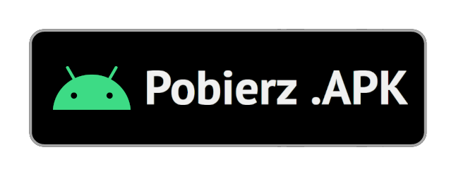

# Szkolny.eu

Nieoficjalna aplikacja do obsługi najpopularniejszych dzienników elektronicznych w Polsce.

## Ważna informacja

Jak zapewne już wiecie, we wrześniu 2020 r. **firma Librus zabroniła nam** publikowania w sklepie Google Play naszej aplikacji z obsługą dziennika Librus&reg; Synergia. Prowadziliśmy rozmowy, aby **umożliwić Wam wygodny, bezpłatny dostęp do Waszych ocen, wiadomości, zadań domowych**, jednak oczekiwania firmy Librus zdecydowanie przekroczyły wszelkie nasze możliwości finansowe. Mając na uwadze powyższe względy, zdecydowaliśmy się opublikować kod źródłowy aplikacji Szkolny.eu. Liczymy, że dzięki temu aplikacja będzie mogła dalej funkcjonować, być rozwijana, pomagając Wam w czasie zdalnego nauczania i przez kolejne lata nauki.

__Zachęcamy do [przeczytania całej informacji](https://szkolny.eu/informacja) na naszej stronie.__

*- Autorzy Szkolny.eu*

## O aplikacji

Szkolny.eu jest nieoficjalną aplikacją, umożliwiającą rodzicom i uczniom dostęp do danych z e-dziennika w każdym smartfonie. Jest to jedyna aplikacja, która posiada wsparcie dla wszystkich najpopularniejszych e-dzienników. Oznacza to, że mając kilka kont w różnych szkołach, wystarczy mieć tylko jedną aplikację.

### Funkcje aplikacji

- plan lekcji, terminarz, oceny, wiadomości, zadania domowe, uwagi, frekwencja
- wygodne **widgety** na ekran główny
- łatwa komunikacja z nauczycielami-**odbieranie, wyszukiwanie i wysyłanie wiadomości**
- pobieranie **załączników wiadomości i zadań domowych**
- **powiadomienia** o nowych informacjach na telefonie lub na komputerze
- organizacja zadań domowych i sprawdzianów-łatwe oznaczanie jako wykonane
- obliczanie **średniej ocen** ze wszystkich przedmiotów, oceny proponowane i końcowe
- Symulator edycji ocen-obliczanie średniej z przedmiotu po zmianie dowolnych jego ocen
- **dodawanie własnych wydarzeń** i zadań do terminarza
- nowoczesny i intuicyjny interfejs użytkownika
- **obsługa wielu profili** uczniów-jeżeli jesteś Rodzicem, możesz skonfigurować wszystkie swoje konta uczniowskie i łatwo między nimi przełączać
- opcja **automatycznej synchronizacji** z E-dziennikiem
- opcja Ciszy nocnej-nigdy więcej budzących Cię dźwięków z telefonu

[Zobacz porównanie funkcji z innymi aplikacjami](https://szkolny.eu/funkcje)

### Pobieranie

Najnowsze wersje możesz pobrać z Google Play lub bezpośrednio z naszej strony, w formacie .APK.

### Kompilacja

Aby uruchomić aplikację „ze źródeł” należy użyć Android Studio w wersji co najmniej 4.2 Beta 6. Wersja `debug` może wtedy zostać zainstalowana np. na emulatorze Androida.

Aby zbudować wersję produkcyjną, tzn. `release` należy użyć wariantu `mainRelease` oraz podpisać wyjściowy plik .APK sygnaturą w wersji V1 i V2.

Warianty `play` oraz `official` są zastrzeżone dla wydań oficjalnych.

## Współpraca

PRy wprowadzające nowe funkcje lub naprawiające błędy są mile widziane!

__Jeśli masz jakieś pytania, zapraszamy na [nasz serwer Discord](https://szkolny.eu/discord).__

## Licencja

Szkolny.eu publikowany jest na licencji [GNU GPLv3](LICENSE). W szczególności, deweloper:
- Może modyfikować oraz usprawniać kod aplikacji
- Może dystrybuować wersje produkcyjne
- Musi opublikować wszelkie wprowadzone zmiany, tzn. publiczny fork tego repozytorium
- Nie może zmieniać licencji ani copyrightu aplikacji

Dodatkowo:
- Zabronione jest modyfikowanie lub usuwanie kodu odpowiedzialnego za zgodność wersji produkcyjnych z licencją.

- **Wersje skompilowane nie mogą być dystrybuowane za pomocą Google Play oraz żadnej platformy, na której istnieje oficjalna wersja aplikacji**.

**Autorzy aplikacji nie biorą odpowiedzialności za używanie aplikacji, modyfikowanie oraz dystrybuowanie.**

Znaki towarowe zamieszczone w aplikacji oraz tym dokumencie należą do ich prawowitych właścicieli i są używane wyłącznie w celach informacyjnych.
